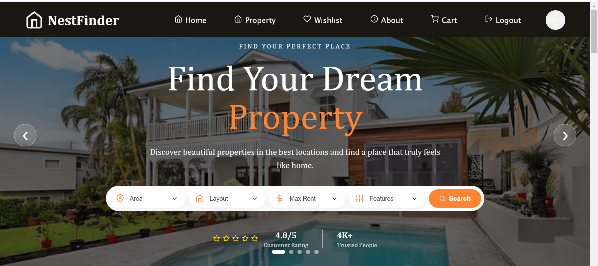
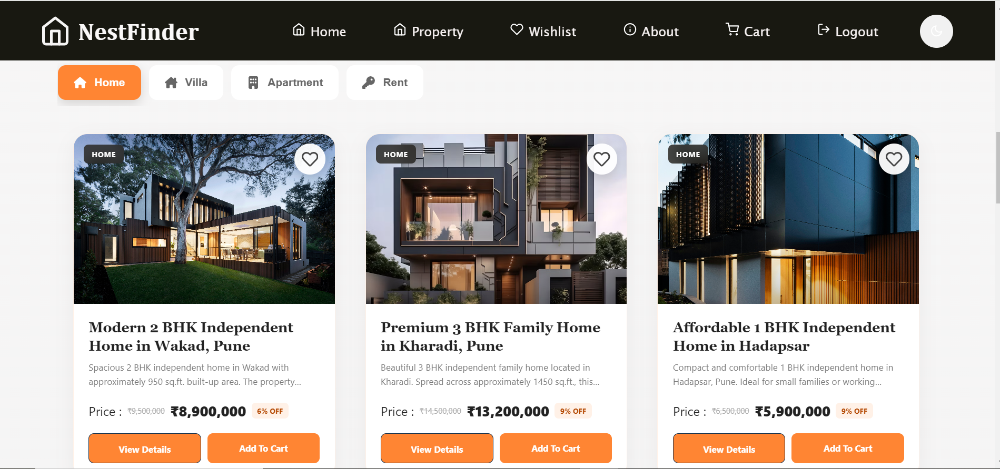
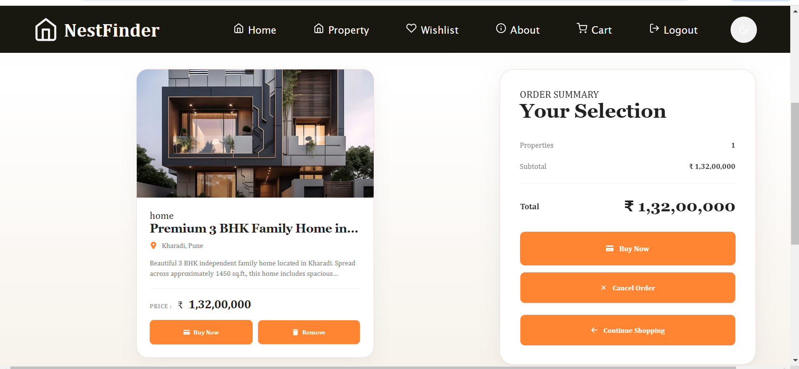

# 🏠 NestFinder - Real Estate Property Finder

NestFinder is a React-based Real Estate Property Finder website
that helps users discover properties for buying and renting.

## 🌐 Live Demo
🔗 

## 📸 ScreenShot

### 🏠 Home Page

### 🛍️ Propety Page

### 🛒 Cart Page

## 🚀 Features

- 🏠 Home page
- 🔍 Property search
- 🏙️ Explore properties by cities
- ⭐ Featured properties
- ❤️ Wishlist
- 👤 Login and Register
- 💬 Talk to a Property Expert
- 📱 Responsive design
- 🌙 Dark / Light mode

## 🛠️ Technologies Used

- React.js
- JavaScript
- HTML5
- CSS3
- React Router DOM
- React Leaflet
- Leaflet
- React Icons
- Vite

## 👥 Contributors

  
  
  
  

## ⭐ Support

If you like this project, give it a ⭐ on GitHub.